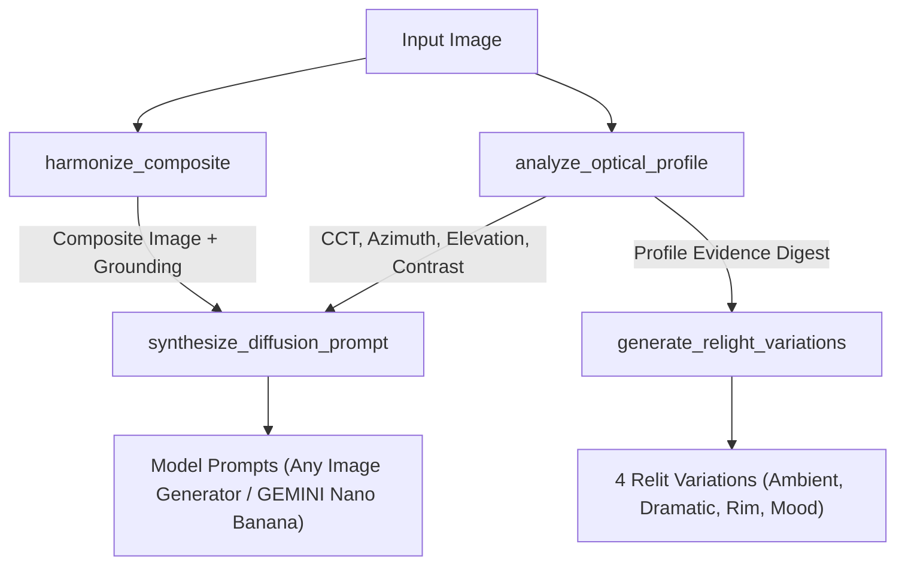

# Architecture Specification: `mcp-relight-harmonize`

> **MarwanDevSpace Architecture Specification**  
> Enterprise-grade Model Context Protocol (MCP) server, npm-distributed binary, and Antigravity Skill.

---

## 1. System Overview

`mcp-relight-harmonize` combines deterministic computer vision algorithms, physical color science, and generative AI prompt engineering into a cohesive, composable MCP system.

```text
               ┌─────────────────────────────────────────────────────────┐
               │    Client Boundary (Antigravity IDE / Claude Desktop)   │
               └────────────────────────────┬────────────────────────────┘
                                            │ stdio (JSON-RPC 2.0)
                                            ▼
               ┌─────────────────────────────────────────────────────────┐
               │         server.py (FastMCP Protocol Assembly)           │
               └────────────┬───────────────┬──────────────┬─────────────┘
                            │               │              │
         ┌──────────────────┼───────────────┼──────────────┼─────────────────┐
         ▼                  ▼               ▼              ▼                 ▼
analyze_optical_profile  generate_relight harmonize_comp  synthesize_prompt optical://presets
         │                  │               │              │                 │
         ▼                  ▼               ▼              ▼                 ▼
  src/domain/optical src/domain/relight src/domain/harm  src/domain/prompt src/resources
         └──────────────────┴───────────────┴──────────────┴─────────────────┘
                                            │
                            ┌───────────────┴───────────────┐
                            │  OpenCV & NumPy & Colour Math │
                            └───────────────┬───────────────┘
                                            │
                            ┌───────────────┴───────────────┐
                            │     Filesystem Cache & IO     │
                            └───────────────────────────────┘
```

---

## 2. Layering, Contracts, and Boundaries

| Layer | Path | Responsibility | Invariants |
|---|---|---|---|
| **Protocol / Assembly** | `server.py` | Registers tools and resources with FastMCP. | No raw business math; routes requests to tool adapters. |
| **Tool Adapters** | `src/tools/` | Translates protocol arguments, executes domain calls, and wraps outputs in the standard result envelope. | Never raises uncaught exceptions to the client; catches and normalizes errors. |
| **Domain Logic** | `src/domain/` | Pure mathematical operations (CCT, surface normal gradients, Reinhard color transfer, Poisson cloning, prompt templates). | Pure computational logic; no MCP SDK or transport dependencies. |
| **Contracts** | `src/contracts/` | Pydantic models, schemas, and typed enums. | Source of truth for validation. |
| **Core Primitives** | `src/core/` | Security guards (`security.py`), error hierarchy (`errors.py`), envelope helpers (`envelope.py`). | Reusable across tools and domain handlers. |
| **Resources** | `src/resources/` | Static/addressable context (`optical://presets`). | Read-only; zero mutation side-effects. |

---

## 3. Tool Interconnection & Pipeline Chaining Standards

In the MarwanDevSpace design, tools form an interconnected, deterministic pipeline. Downstream tools ingest the physical measurements established by upstream analyzers:



### Evidence Chaining Rules
1. **Inputs Digest:** Each tool computes a canonical `sha256` digest of inputs (`evidence.inputsDigest`).
2. **Artifact Provenance:** Output files written to disk are listed in `evidence.artifacts` with local file URIs.
3. **Next-Action Guidance:** Every response provides human- and agent-readable hints in `nextActions` to transition smoothly to the next pipeline stage.

---

## 4. Standard Result Envelope

All MCP tools adhere to the MarwanDevSpace Standard Result Envelope:

```json
{
  "status": "success | partial | blocked | failed",
  "summary": "Human-readable executive summary of the outcome",
  "data": { /* Domain-specific typed payload */ },
  "warnings": [ /* Non-fatal warnings */ ],
  "evidence": {
    "inputsDigest": "sha256:...",
    "sources": [ { "label": "...", "uri": "file://..." } ],
    "artifacts": [ { "label": "...", "uri": "file://...", "sha256": "..." } ]
  },
  "nextActions": [ "Suggested subsequent tool calls" ]
}
```

---

## 5. NPM & GitHub Distribution Architecture

The project is dual-packaged for Python and Node.js ecosystems:

- **`package.json`**: NPM package manifest enabling installation and execution via `npx mcp-relight-harmonize`.
- **`bin/mcp-relight-harmonize.js`**: Cross-platform Node.js launcher that detects local virtual environments (`.venv`) or system Python and establishes stdio stdio communication.
- **`.github/workflows/ci.yml`**: Continuous Integration testing across Python 3.10/3.11 and Node 18/20, running Pytest, launcher verification, and `npm pack --dry-run`.

---

## 6. Antigravity Skill Ecosystem (`.agents/skills/`)

The repository integrates directly into the Antigravity agent architecture as an on-demand skill:

```text
.agents/skills/mcp-relight-harmonize/
├── SKILL.md                          # Main agent instructions with YAML frontmatter
├── references/
│   ├── optical_math.md               # CIE XYZ, McCamy CCT, Normal tensors, Reinhard
│   ├── tool_orchestration.md         # Interconnection criteria, evidence chaining, fallback rules
│   └── diffusion_guide.md            # Prompt tokens & parameters for Any Image Generator / GEMINI Nano Banana
└── scripts/
    ├── run_pipeline.py               # Standalone CLI pipeline runner
    └── verify_server.py              # Self-contained tool & resource verifier
```

---

## 7. Master Persona Reference (`MASTER.md`)

The governance, technical standards, and voice of the repository are anchored in [MASTER.md](../MASTER.md), enforcing protocol purity, optical realism, security boundaries, and release quality gates.
